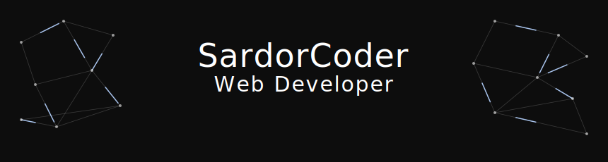

  

<h3 align="center">Hi there! My name is Sardor. I'm a Web Developer from Uzbekistan. 👋</h3>

  I build clean and scalable web applications and backend systems. 
  I work with <b>Express.js</b>, <b>NestJS</b>, <b>JavaScript</b>, <b>TypeScript</b>, <b>C</b>, and <b>Python</b>. 
  I also use <b>MySQL</b> and <b>PostgreSQL</b> to build reliable database-driven applications.

  
  

